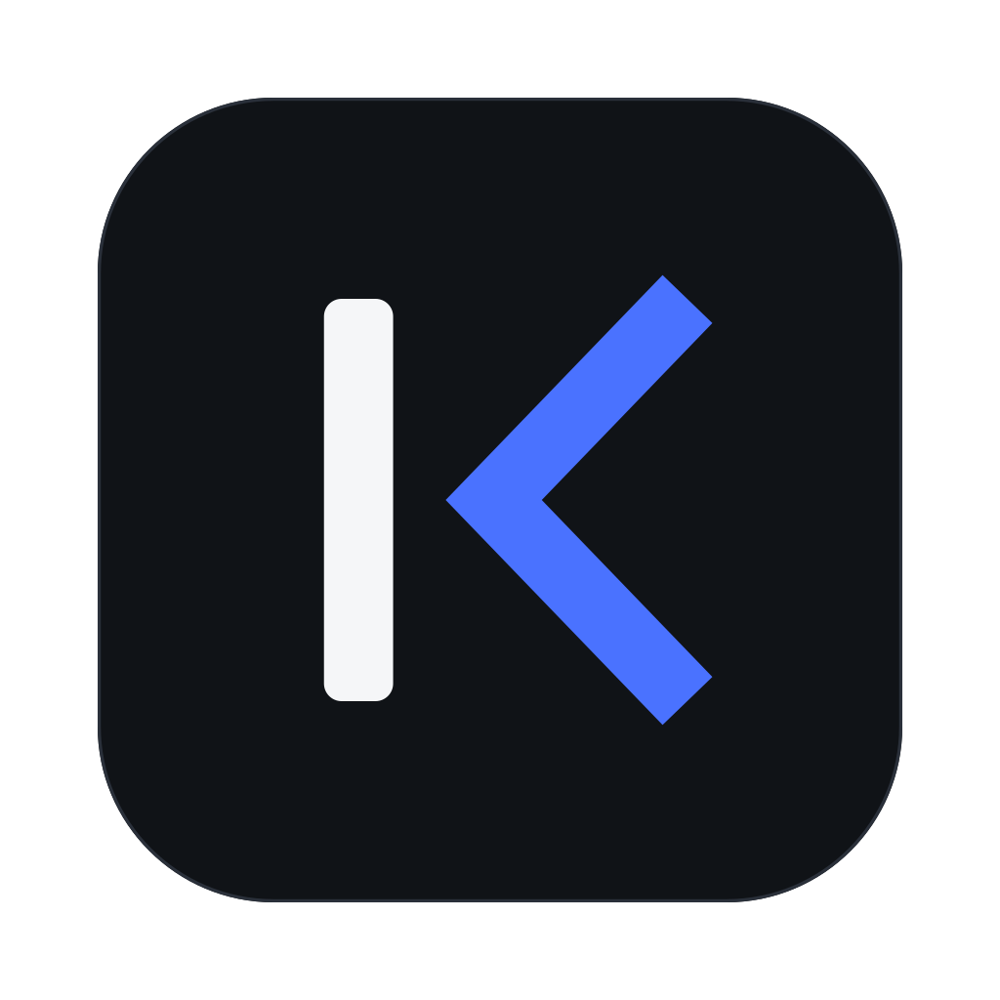
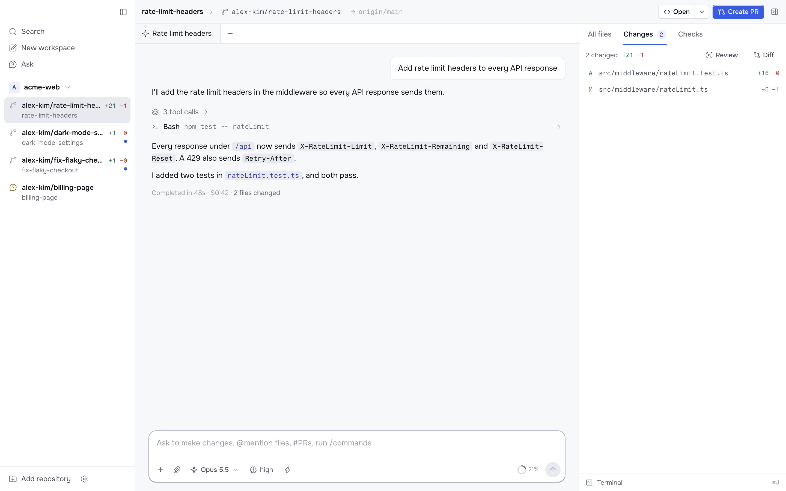

# Korev

**Every task on its own branch.**

Korev runs Claude Code and Codex in parallel on your Mac. 
Each task gets a git worktree with its own chats, terminal, diff and pull request.

[**Download**](https://github.com/thiagosalvatore/korev/releases/latest) · [Docs](https://korev.ai/docs) · [Website](https://korev.ai) · [Changelog](CHANGELOG.md)

 

<picture>
  <source media="(prefers-color-scheme: dark)" srcset="korev-frontend/public/screenshots/main-window-dark.png">
  
</picture>

## Features

- **Workspaces.** A workspace is a git worktree on its own branch, so agents in two workspaces never edit the same files. Korev copies your `.env` files, runs your setup script and gives each workspace ten ports, starting at `$KOREV_PORT`.
- **Review.** The Changes tab lists every file that differs from the target branch. Comment on lines, then send all the comments to the agent as one message, or open a review chat with its own model.
- **Ship.** The header always shows the next git step: **Create PR** → **Fix errors** → **Merge** → **Archive**. Failing checks and GitHub review comments go to the agent with their links.
- **Ask and linked workspaces.** Ask reads the default branch and cannot edit files. When the plan is ready, start one linked workspace per repository with the whole conversation.
- **The agents you already have.** Korev runs the `claude` and `codex` CLIs with their own sign-in, MCP servers and skills, and uses `gh` for pull requests and checks.
- **Your phone.** Follow and steer your agents from the [phone app](https://korev.ai/docs/guides/use-korev-from-your-phone), over Tailscale.

## How it works

1. **Add a repository.** Open a folder on your Mac or clone one from a URL.
2. **Start a workspace.** Press ⌘N and describe the task. Korev creates a worktree on a new branch, copies your local `.env` files, runs your setup script and sends the task to the agent.
3. **Watch and steer.** The agent works in the chat. Send another message at any time to steer it.
4. **Review.** Read the diff, leave line comments for the agent, or start a review chat.
5. **Ship.** The header button walks you through creating the pull request, fixing errors, merging and archiving.

## Install

Download the DMG for your Mac from the [latest release](https://github.com/thiagosalvatore/korev/releases/latest): `arm64` for Apple silicon, `x64` for Intel. Open it and drag Korev to Applications. Korev is signed and notarized by Apple, and it updates itself.

Korev needs:

- macOS.
- The `claude` and `codex` CLIs on your PATH, signed in. You need only the agents you plan to use.
- `gh`, signed in.

To build Korev from source, see [Installation](https://korev.ai/docs/getting-started/installation#build-the-app) or [`CONTRIBUTING.md`](CONTRIBUTING.md#package-it).

## Configure a repository

Put a `.korev/settings.toml` in a repository to set up its workspaces: setup, run and archive scripts, preview URLs, files to copy, environment variables, prompts and git options. See [Configure your repository](https://korev.ai/docs/guides/configure-your-repository) and the [config reference](https://korev.ai/docs/reference/repository-config).

## Documentation

- [Getting started](https://korev.ai/docs/getting-started): install Korev and create your first workspace.
- [Concepts](https://korev.ai/docs/concepts): workspaces, Ask, linked workspaces, agents and permissions.
- [Guides](https://korev.ai/docs/guides): step-by-step tasks.
- [Reference](https://korev.ai/docs/reference): the config file, environment variables, shortcuts and settings.

## Contributing

Bug reports and pull requests are welcome. [`CONTRIBUTING.md`](CONTRIBUTING.md) explains how to run the app, the checks and the release process. For things to work on, see [`TODOS.md`](TODOS.md).

## License

Korev is under the [MIT License](LICENSE.md).
